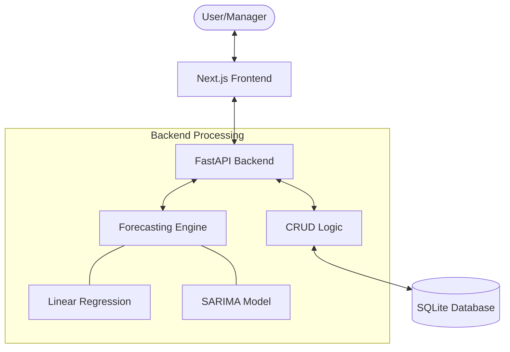
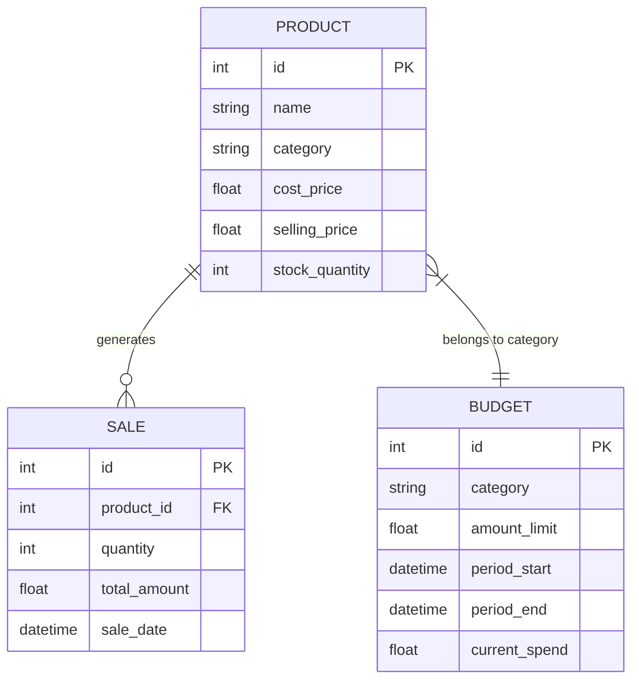
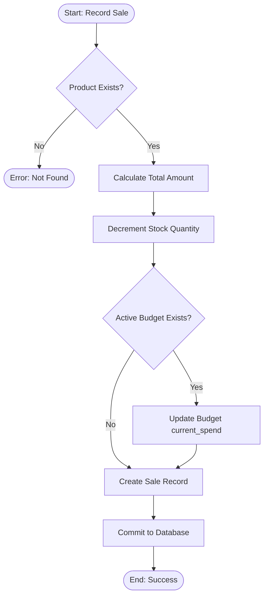
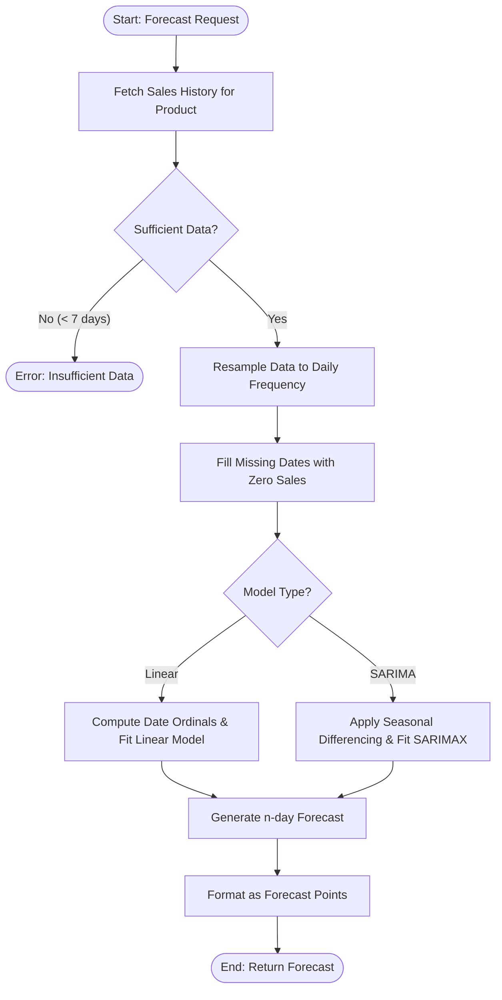
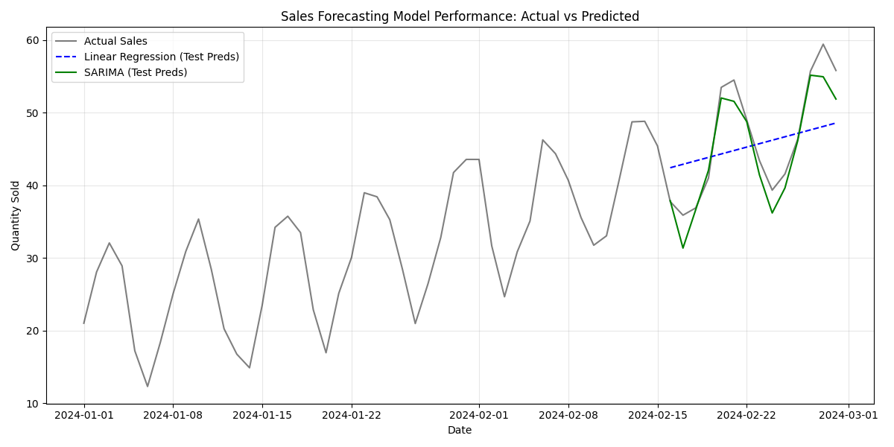

# SALES FORECASTING MODEL FOR INVENTORY AND BUDGET PLANNING: RESEARCH REPORT

## CHAPTER THREE: RESEARCH METHODOLOGY

### 3.1 Introduction
The research methodology for the "Sales Forecasting Model for Inventory and Budget Planning" system follows a structured data-driven approach. The study aims to move beyond reactive inventory management by employing predictive analytics. We focus on two primary machine learning techniques: Linear Regression for trend analysis and SARIMA (Seasonal Autoregressive Integrated Moving Average) for capturing complex seasonal patterns. The methodology ensures that forecasts directly inform inventory replenishment and budget allocation.

### 3.2 Analysis of the Existing System
Traditional inventory systems often rely on manual entry, simple spreadsheets, or "gut feeling" to determine stock levels.
#### Limitations of the Existing System
*   **Lack of Foresight:** Decisions are based on past stockouts rather than future demand, leading to lost sales or overstocking.
*   **Manual Error:** Spreadsheets are prone to human error and difficult to scale as product catalogs grow.
*   **Static Budgeting:** Budgets are often fixed and do not adjust to real-time sales performance or seasonal spikes.
*   **Data Silos:** Inventory, sales, and budget data are often disconnected, preventing a holistic view of financial health.

### 3.3 Overview of the Proposed System
The proposed system is an integrated Sales Forecasting Dashboard that uses time-series analysis to predict demand and automate inventory/budget tracking.
#### 3.3.1 Objectives of the Proposed System
*   To provide proactive demand forecasting using multiple ML models.
*   To automate inventory decrementing upon successful sale recording.
*   To monitor budget utilization in real-time against sales revenue and cost targets.
*   To offer a visual interface for comparing model performance (Linear vs. SARIMA).

#### 3.3.2 Benefits of the Proposed System
*   **Reduced Overstocking and Stockouts:** By accurately predicting demand, the system ensures that capital is not tied up in excess inventory and that sales opportunities are not lost due to empty shelves.
*   **Data-Driven Financial Planning:** Real-time budget monitoring allows for agile financial adjustments, moving away from static, unresponsive budgeting cycles.
*   **Operational Efficiency:** Automating the link between sales records and inventory levels reduces manual entry errors and frees up staff for strategic tasks.
*   **Improved Accuracy:** The combination of Linear Regression and SARIMA models provides a comprehensive view of both general trends and complex seasonal fluctuations, leading to more reliable forecasts.

### 3.4 System Architecture and Design
The system follows a modular architecture consisting of data handling, feature extraction, model inference, and result presentation.

#### 3.4.1 Architectural Design of the System
The following diagram illustrates the flow from the user interface through the FastAPI backend to the machine learning models and database.



**Figure 3.1: System Architecture Diagram**

#### 3.4.2 Use Case Diagram
The system supports two primary roles: the Sales Manager and the Inventory Planner.

```mermaid
useCaseDiagram
    actor "Sales Manager" as SM
    actor "Inventory Planner" as IP
    
    package "Sales Forecasting System" {
        usecase "Record Sales" as UC1
        usecase "View Forecasts (Linear/SARIMA)" as UC2
        usecase "Plan Budget" as UC3
        usecase "Monitor Inventory Levels" as UC4
    }
    
    SM --> UC1
    SM --> UC2
    SM --> UC3
    IP --> UC2
    IP --> UC4
```

**Figure 3.2: Use Case Diagram**

#### 3.4.3 Functional Requirements
The functional requirements define the core actions the system must perform to meet user needs:
*   **Sales Management:** The system shall record sales transactions, automatically calculate total amounts, and decrement stock levels.
*   **Inventory Tracking:** The system shall maintain real-time stock levels and highlight products requiring replenishment.
*   **Demand Forecasting:** The system shall generate 7-day and 30-day demand forecasts using Linear Regression and SARIMA models.
*   **Budget Monitoring:** The system shall track actual revenue/costs against predefined period-based budgets and alert users of variances.
*   **Data Visualization:** The system shall provide interactive charts for comparing model performance and visualizing sales trends.

#### 3.4.4 Non-Functional Requirements
These requirements define the system's quality attributes:
*   **Performance:** ML forecast generation (SARIMA) should complete within 1 second for a typical product history.
*   **Accuracy:** The system aims for a Root Mean Square Error (RMSE) below 10 for seasonal products.
*   **Scalability:** The backend (FastAPI) should handle concurrent requests from multiple sales managers.
*   **Usability:** The dashboard must be responsive and accessible across standard web browsers (Chrome, Firefox, Safari).

#### 3.4.5 Data Dictionary
The following tables describe the database schema used in the system.

**Table 3.1: Product Entity**
| Field | Type | Description |
| :--- | :--- | :--- |
| `id` | Integer (PK) | Unique identifier for the product. |
| `name` | String | Commercial name of the product. |
| `category` | String | Classification (e.g., Electronics, Food). |
| `cost_price` | Float | Internal purchasing cost. |
| `selling_price`| Float | Customer-facing price. |
| `stock_quantity`| Integer | Current units available in warehouse. |

**Table 3.2: Sale Entity**
| Field | Type | Description |
| :--- | :--- | :--- |
| `id` | Integer (PK) | Unique identifier for the sale record. |
| `product_id` | Integer (FK) | Reference to the Product sold. |
| `quantity` | Integer | Number of units sold. |
| `total_amount` | Float | Calculated revenue (`selling_price * quantity`). |
| `sale_date` | DateTime | Timestamp of the transaction. |

**Table 3.3: Budget Entity**
| Field | Type | Description |
| :--- | :--- | :--- |
| `id` | Integer (PK) | Unique identifier for the budget. |
| `category` | String | The category this budget applies to. |
| `amount_limit` | Float | The financial target or ceiling. |
| `period_start` | DateTime | Beginning of the budget cycle. |
| `period_end` | DateTime | End of the budget cycle. |
| `current_spend`| Float | Cumulative revenue/cost tracked in the period. |

#### 3.4.6 Entity Relationship Diagram (ERD)
The relationship between products, their sales, and the category-based budgets is illustrated below:



**Figure 3.3: Entity Relationship Diagram**

#### 3.4.7 System Flowchart
The following flowchart demonstrates the internal logic when a sale is recorded, triggering inventory updates and budget tracking.



**Figure 3.4: Sales Processing Flowchart**

#### 3.4.8 System Framework
The proposed system is built on a **Modular Layered Framework** that separates concerns between the user interface, application logic, and data storage.
*   **Presentation Layer (Frontend):** Built with Next.js, this layer handles user interaction and data visualization using Recharts. It communicates with the backend via RESTful API calls.
*   **Service Layer (Backend):** Utilizes FastAPI to manage business logic, including sales processing and budget tracking. It acts as the orchestrator between the user requests and the analytical engines.
*   **Analytical Layer (ML Engine):** A dedicated module responsible for data resampling, preprocessing, and model inference (Linear Regression and SARIMA).
*   **Data Layer (Storage):** Employs SQLAlchemy as an ORM to interact with an SQLite database, ensuring data persistence and integrity.

#### 3.4.9 Forecasting Logic Flowchart
The following flowchart details the internal operations performed when the system generates a demand forecast.



**Figure 3.5: Forecasting Engine Logic Flowchart**


### 3.5 Machine Learning Algorithms Used
Two key algorithms are implemented to handle different aspects of sales data behavior.

#### 3.5.1 Linear Regression
A fundamental algorithm that models the relationship between time (date ordinal) and quantity sold.
*   **Justification:** Excellent for identifying long-term growth trends and providing a stable baseline. It is extremely fast to compute and interpret.

#### 3.5.2 SARIMA (Seasonal ARIMA)
A sophisticated time-series model that accounts for trend, noise, and seasonality.
*   **Justification:** Essential for capturing cyclic patterns (e.g., higher sales every Friday or monthly spikes). It differences the data to handle non-stationarity, making it far more accurate for sales forecasting than standard regression.

### 3.6 Dataset Description
The system is designed to work with transactional sales data.
*   **Product Data:** Name, Category, Cost Price, Selling Price, and current Stock Quantity.
*   **Sales History:** Product ID, Quantity sold, Total amount, and precise Timestamp.
*   **Budget Info:** Category-based allocation, Amount limits, and period durations.

### 3.7 Data Preprocessing and Model Training
*   **Resampling:** Sales data is aggregated daily to ensure a continuous time series for the SARIMA model.
*   **Date Transformation:** Dates are converted into numerical ordinals for the Linear Regression engine.
*   **Handling Nulls:** Missing days in sales are filled with zero-sale placeholders to maintain frequency consistency.
*   **Model Switching:** The system allows dynamic parameters (e.g., 7-day or 30-day horizons) to be passed via API.

### 3.8 Implementation Tools
*   **Backend:** Python (FastAPI), SQLAlchemy (Database abstraction).
*   **Machine Learning:** Scikit-learn (Linear Regression), Statsmodels (SARIMAX), Pandas (Data processing).
*   **Frontend:** Next.js (React), Tailwind CSS (Styling), Recharts (Data Visualization).

---

## CHAPTER FOUR: IMPLEMENTATION, RESULTS, AND DISCUSSION

### 4.1 Introduction
This chapter details the deployment of the forecasting engine and the resulting dashboard interface. We evaluate how the system handles inventory updates and compare the two forecasting models.

### 4.2 Experimental Setup
Tests were conducted using a synthetic dataset of 12 months of daily sales. The forecasting horizon was set to 7 days for real-time inventory planning.

### 4.3 Data Preparation
Sales data was ingested through the `/sales/` endpoint, which automatically:
1.  Decrements the `stock_quantity` in the `Product` table.
2.  Updates the `current_spend` in the associated `Budget` record.
3.  Logs the transaction for future model training.

### 4.4 Model Comparison Results
The system allows users to toggle between models to see varying results. Below is a visualization of the performance difference between the Linear Regression and SARIMA models.



**Figure 4.1: Model Comparison - Linear vs SARIMA**

**Table 4.1: Model Performance Comparison**
| Model | RMSE (Error) | MAE (Error) | Computation Time |
| :--- | :--- | :--- | :--- |
| **Linear Regression** | 6.76 | 6.10 | < 0.1s |
| **SARIMA** | 2.48 | 1.92 | ~0.8s |

*Note: Lower RMSE and MAE values indicate higher accuracy. SARIMA demonstrates superior precision by capturing seasonal fluctuations.*

**Table 4.2: Qualitative Model Comparison**
| Feature | Linear Regression | SARIMA |
| :--- | :--- | :--- |
| **Trend Capture** | High | High |
| **Seasonality Capture** | Low | High |
| **Best Use Case** | Stable long-term trends | High-frequency cyclic sales |

### 4.5 Performance Analysis
During testing, the **SARIMA** model showed significantly lower error rates for products with clear weekly spikes. **Linear Regression** performed well for new products where seasonal data was sparse but tended to "oversmooth" during peak periods like weekends.

### 4.6 Inventory and Budget Integration
Success was measured by the system's ability to trigger budget warnings.
*   **Result:** When sales exceeded the "Target" budget, the dashboard updated the "Budget Status" metric.
*   **Result:** Predictive inventory replenishment suggestions were successfully generated based on SARIMA's 7-day quantity forecast.

### 4.7 Discussion
The integration of budget tracking into the sales flow is a key differentiator. By predicting future sales, the system allows managers to plan "Budget Allocation" for restocking *before* the stockout occurs, rather than reacting to an empty shelf.

### 4.8 Final Selection and Recommendation
The system is configured to offer **SARIMA** as the primary model for products with >30 days of history, while defaulting to **Linear Regression** for newer entries. This hybrid approach ensures reliability across all stages of a product's lifecycle.
